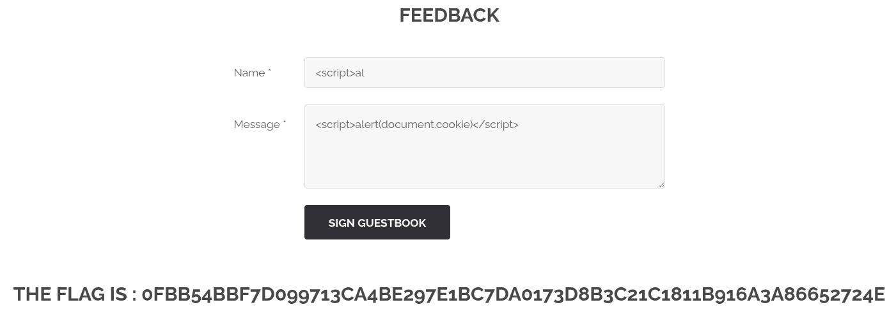

# Exploit Stored XSS

## Basic mechanism

1. An attacker finds an input point in a web application that doesn't properly validate or sanitize user input
2. They inject malicious JavaScript code through this entry point
3. When other users access the affected page, their browsers execute the injected code
4. The code runs with the privileges of the legitimate website in the victim's browser

## What can this do ?

- Steal cookies and session tokens (as shown in your example)
Capture sensitive information
- Perform unauthorized actions on behalf of the victim
- Redirect users to malicious sites
- Deface websites

## What we did

In `http://localhost:8080/?page=feedback` we have a feedback page where we can see other people name and messages.
So we try to use an XSS attack in the message field.
```bash
<script>alert(document.cookie)</script>
```
And it works.


# Patch

- Server-Side Input Sanitization
- Output Encoding When Displaying Feedback
- Add Content Security Policy