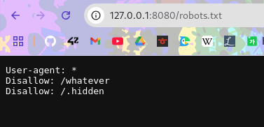
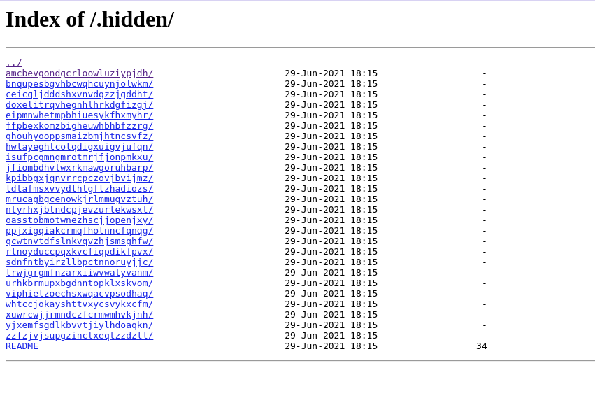
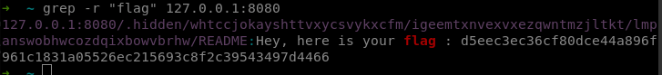

Same start as the whatever_htpasswd breach, we first check the robots.txt url and will focus on the .hidden folder this time

The .hidden contains a ton of folder and subfolder, which is impossible to check by hand, let's do a script to check them all

wget -e robots=off --no-parent --mirror 127.0.0.1:8080/.hidden/

This download all the files in the .hidden folder, we can then just look for the flag with grep

grep -r "flag" 127.0.0.1:8080

We find the flag and we can now see the path to follow in the files structures to actually find it by hand if necessary

# How to fix it

Well just don't put flags in any folder that is accessible from outside, also don't give hints about sensitive urls in the robots.txt.
The robots.txt file is not a security measure and should not be used to protect sensitive information.
