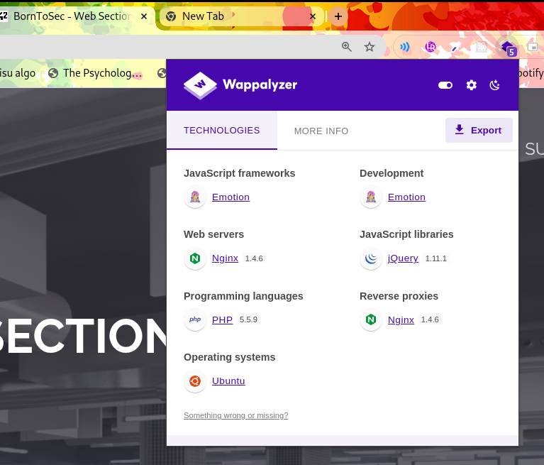

By inspecting the page using a tool like wappalyzer, we can that the website is using nginx.



If misconfigured, nginx can expose sensitive information about the server and its configuration. One vulnerability is the LFI (Local File Inclusion) vulnerability, which allows an attacker to include files on a web server through the browser. This can lead to the exposure of sensitive files such as /etc/passwd, which contains user account information.
This can be exploited by manipulating the URL to include the file path. For example, if the URL is vulnerable, an attacker could use a payload like:

```
http://localhost:8080/index.php?page=../../../../etc/passwd
```

This would attempt to include the /etc/passwd file, potentially exposing sensitive information about the server's user accounts.

If we try that we get the following


which the vulnerability is confirmed and we just have to find the flag now.

By moving up the directory tree, we finally found the passwd and the flag

http://localhost:8080/index.php?page=../../../../../../../etc/passwd


# How to fix it

The vulnerability can be fixed by properly validating and sanitizing user input, ensuring that only authorized files can be included. This can be done by implementing a whitelist of allowed files or using secure coding practices to prevent directory traversal attacks. Additionally, server configurations should be reviewed to ensure that sensitive files are not accessible through the web server.
