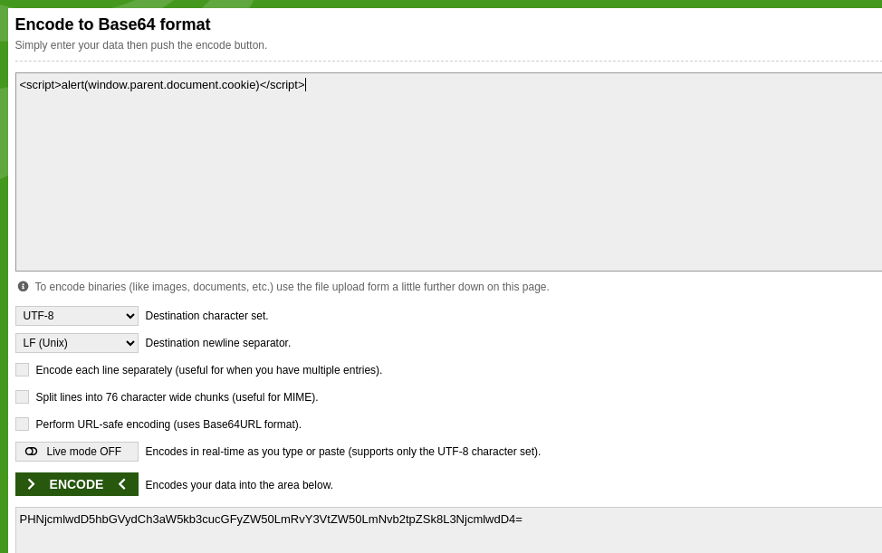

In the homepage we have a link to an image, this link shows a page containing an image but the src is modified according to the url.

```
http://localhost:8080/?page=media&src=nsa
```

This allows for xss injection. The idea is to execute code in the context of the page. Usually just a simple alert() is used as a proof of concept but the usage is limitless.
In our case the goal is just to make the src equals to something like this `data:text/html,<script>alert(window.parent.document.cookie)</script>` but any other word than nsa is not accepted.
The solution is to encode the string in base64 and use it as a src. The server will decode it and execute the code.
To achieve this we have to encode our payload into base64 and then use it as a src. We can use decode.



So we just make the url like so : http://localhost:8080/?page=media&src=data:text/html;base64,PHNjcmlwdD5hbGVydCgnSGVsbG8gV29ybGQhJyk8L3NjcmlwdD4= and it will execute the code in the context of the page.
We get the flag.


# How to fix

The solution is to use a CSP (Content Security Policy) header to prevent the execution of inline scripts. This can be done by adding the following header to the response:

Also the content of the page should never be modified according to the url. The src should be a static value and not modified according to the url. This can be done by using a whitelist of allowed values for the src attribute. The server should only allow certain values for the src attribute and reject any other values. This can be done by using a regular expression to validate the src attribute. User input can always lead to breaches and should be avoided as often as possible
