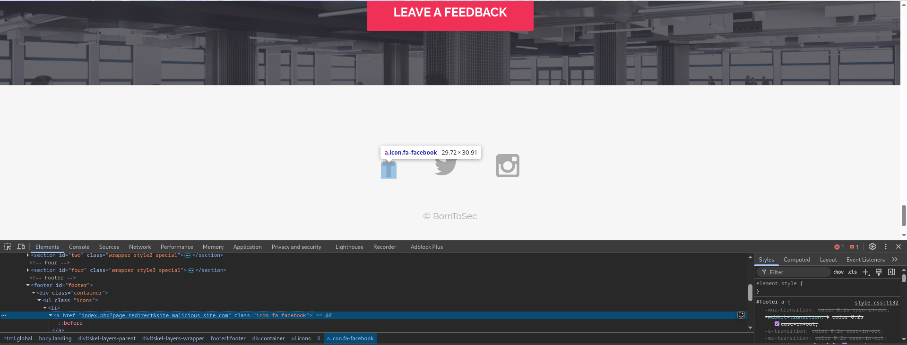

In the footer of the homepage we see that there are icons for social media. The icons are clickable and redirect to the respective social media pages.
If we inspect the elements we see that the links are in the form of `index.php?page=redirect&site=twitter` for the twitter icon.
This is a clear indication of an open redirect vulnerability.
The URL index.php?page=redirect&site=twitter is an example of an open redirect vulnerability. This type of vulnerability occurs when a web application takes a user-supplied input (in this case, the site parameter) and redirects the user to the specified URL without proper validation or sanitization. An attacker can exploit this vulnerability to redirect users to malicious websites or phishing pages.

For example, an attacker can craft a URL like the following to redirect users to a malicious website:
index.php?page=redirect&site=http://malicious-website.com

To fix this vulnerability, the application should validate the url. This can include checking the input against a whitelist of allowed URLs or encoding the input to prevent malicious redirects.
