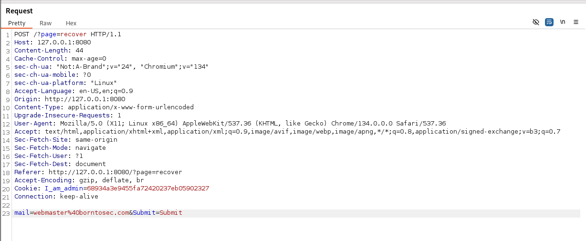
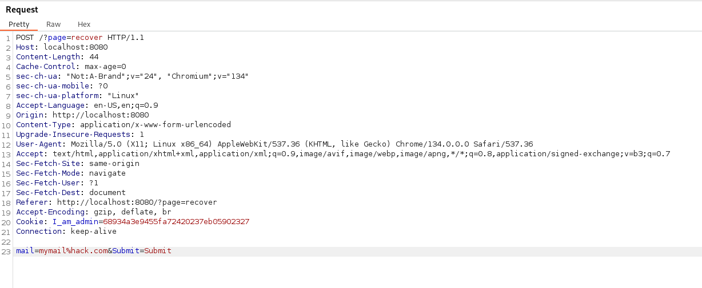
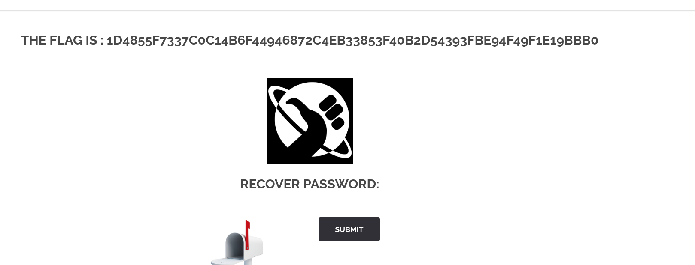

In the login page we see a link to recover our password, following that link we arrive in a page containing a form used to send the password. After submitting it we see that the requests contains a variable with the mail address of the admin. By intercepting the request we can just modify that field to our own email and this gets us the flag.

The request looks like this:


And here we modify the request:



And get this response



The flag:

```
1d4855f7337c0c14b6f44946872c4eb33853f40b2d54393fbe94f49f1e19bbb0
```

# How to fix

The password recovery page should not send the email address in the request. Instead, it should send a unique token that is generated for each user. This token should be stored in the database and associated with the user's account. When the user submits the form, the server should check if the token is valid and associated with the user's account before sending the password recovery email. Modifying the email adress in the request is very weak and easy to bypass.
