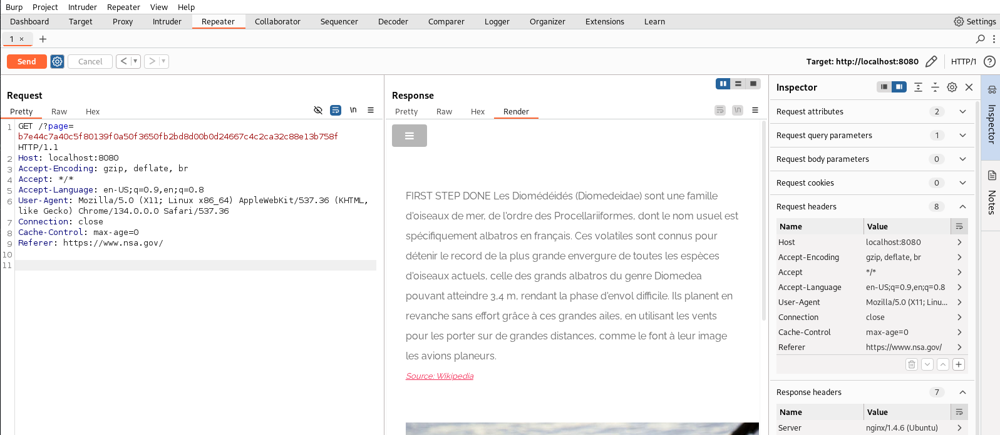
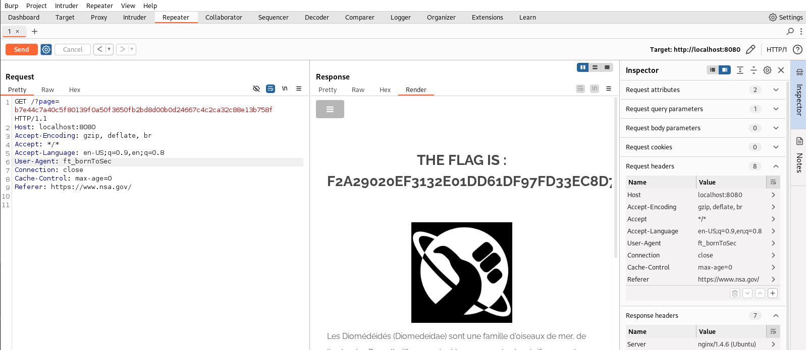

In the footer of the homepage there is a link to a strange url

http://localhost:8080/?page=b7e44c7a40c5f80139f0a50f3650fb2bd8d00b0d24667c4c2ca32c88e13b758f

This urls seems harmless but in the content of the page we can see that there are comments.
Most of them are useless but the important bit is the following:

<!--
You must come from : "https://www.nsa.gov/".
-->
<!--
Let's use this browser : "ft_bornToSec". It will help you a lot.
-->

This means that we need to come from the NSA website and use the browser `ft_bornToSec` to access the page.

We can easily spoof the referer and the user agent with burp

Once we had the referer to the request in burp the content of the response changes

After that we can also modify the user agent to `ft_bornToSec` and we get the flag

## How to fix it

Well just don't trust the referer and the user agent. They can be easily spoofed. You should use a session cookie or a token to authenticate the user.
Also don't give hints to the user about how to access the page. This is a major security risk.
