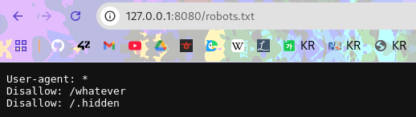
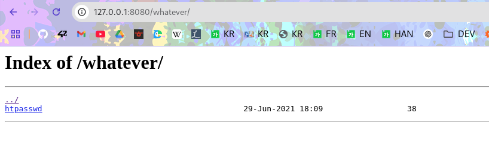
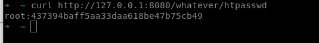
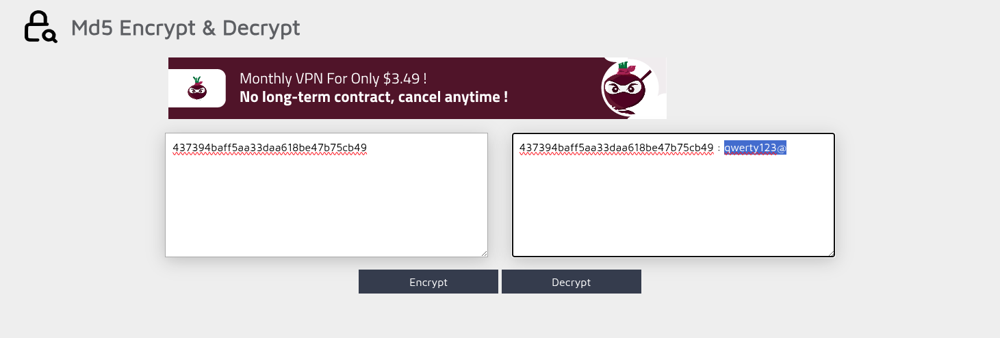
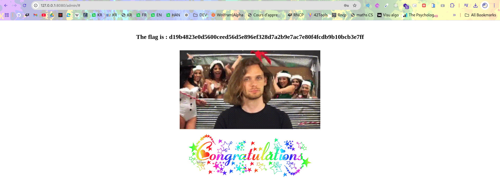

The robots.txt file is often used by website to give informations about the website to robots, crawlers and search engines. By visiting the url we get two interesting lines:


```
Disallow: /whatever
Disallow: /.hidden
```

Which clearly indicates two urls we can visit as an intruder. In this section we will focus on the first one.
In the folder `whatever` we can find a file called `htpasswd`. This file is used to store the username and password to access the website. The file is not protected and we can download it and read it or just see it with curl



curl http://127.0.0.1:8080/whatever/htpasswd



We get root:437394baff5aa33daa618be47b75cb49

root is the correct username but the password is hashed, we have to try to reverse it and get the password.
Usually it is hashed using md5 or sha1.
Here we can try to reverse the password
https://md5decrypt.net/



And we get the password: qwerty123@ which looks like a very good password.

Then we simply enter thos crendentials in the admin page and we get the flag.



The flag is

```
d19b4823e0d5600ceed56d5e896ef328d7a2b9e7ac7e80f4fcdb9b10bcb3e7ff
```

# How to fix it

Don't use htpasswd to store the password. Use a database and hash the password with bcrypt or argon2. Also don't use a weak password like qwerty123@. Use a strong password with at least 12 characters, uppercase, lowercase, numbers and special characters.
Don't put the url of the htpasswd in the robots.txt file. This is a major security risk. The robots.txt file is not a security measure and should not be used to protect sensitive information. Don't use the MD5 hash function since it can be easily reversed.
Ask for credentials before giving access to the htpasswd file.
